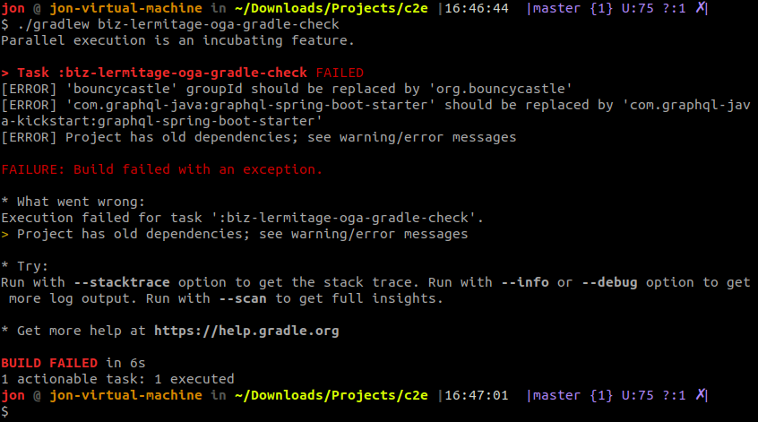

<h1 align="center">
    Old GroupIds Alerter - Gradle Plugin
</h1>

<p align="center">
    <a href="https://github.com/jonathanlermitage/oga-gradle-plugin/actions/workflows/ci.yml?query=workflow%3ABuild"></a>
    <a href="https://github.com/jonathanlermitage/oga-gradle-plugin/blob/master/LICENSE.txt"></a>
</p>

*Looking for a Maven plugin? Check [oga-maven-plugin](https://github.com/jonathanlermitage/oga-maven-plugin).*

A Gradle plugin that checks for deprecated *groupId + artifactId* couples, in order to reduce usage of non-maintained 3rd-party code (e.g. did you know that artifact `graphql-spring-boot-starter` moved from `from com.graphql-java` to `com.graphql-java-kickstart`?).

> [!NOTE]
> Plugin v1.1.1 was tested with Gradle 4.10.3, 5.6.4, 6.9.1 and 7.3.1 on JDK8 and JDK11.  
> Starting from plugin v2.0.0, it's tested with Gradle 8 and 9 on JDK21, and it is compatible with Gradle's configuration cache, which should be enabled by default in Gradle 10. Previous Gradle and Java versions are no longer supported.

## Author

Jonathan Lermitage (<jonathan.lermitage@gmail.com>)  
Linkedin profile: [jonathan-lermitage-092711142](https://www.linkedin.com/in/jonathan-lermitage-092711142/)

## Usage

Using the plugins DSL:

```groovy
plugins {
  id "biz.lermitage.oga" version "2.0.0"
}
```

Otherwise, using legacy plugin application:

```groovy
buildscript {
  repositories {
    maven {
      url "https://plugins.gradle.org/m2/"
    }
  }
  dependencies {
    classpath "gradle.plugin.biz.lermitage.oga:oga-gradle-plugin:2.0.0"
  }
}

apply plugin: "biz.lermitage.oga"
```

Then launch `./gradlew biz-lermitage-oga-gradle-check`. If any deprecated *groupId + artifactId* couple is found, error message(s) will be displayed and the Gradle build will fail.

See [plugins.gradle.org/plugin/biz.lermitage.oga](https://plugins.gradle.org/plugin/biz.lermitage.oga) for details.



## Build

`./gradlew build`

## Contribution

### Code 

Open an issue or a pull-request. Contributions must be tested.  
Please reformat new code only: do not reformat the whole project or entire existing file (in other words, try do limit the amount of changes in order to speed up code review).

### Definitions file

See [oga-maven-plugin#definitions-file](https://github.com/jonathanlermitage/oga-maven-plugin#definitions-file). The same definitions file is used for both Maven and Gradle plugins.

### Find new entries for definitions file

See [oga-maven-plugin#find-new-entries-for-definitions-file](https://github.com/jonathanlermitage/oga-maven-plugin#find-new-entries-for-definitions-file).

## License

MIT License. In other words, you can do what you want: this project is entirely OpenSource, Free and Gratis.
